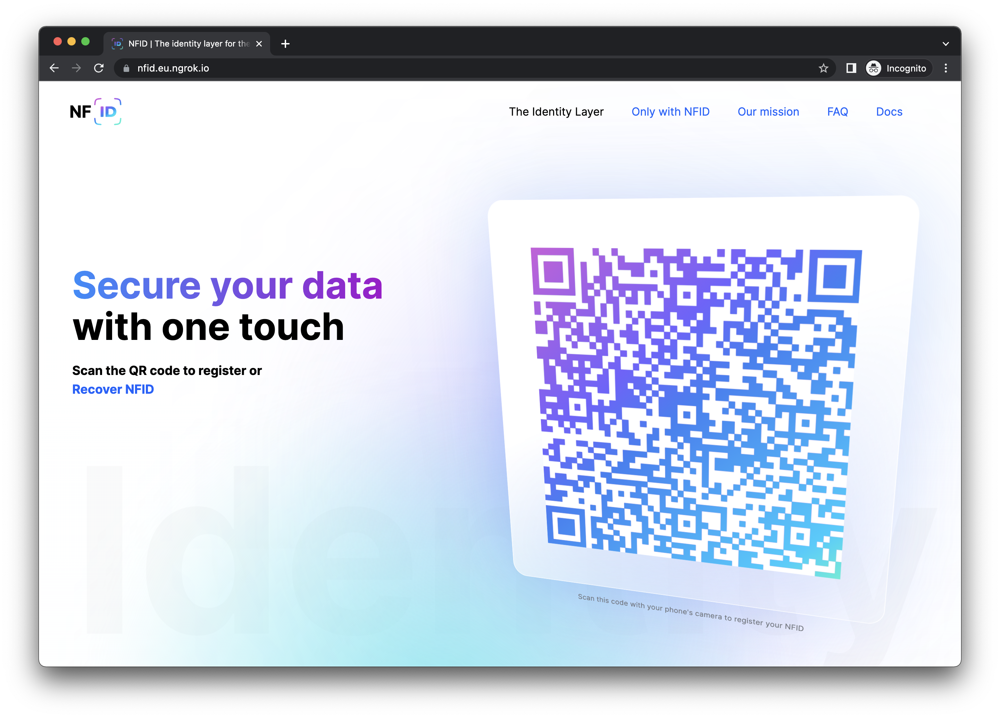

<p align="center">
  
</p>
 
---

### Table of contents[](#table-of-contents)

- [Introduction](#introduction)
- [Spinning up nfid locally for local integration](#introduction)
- [Packages](#packages)
- [Examples](#examples)
- [Contribution Guidelines](#guidelines)
- [Licensing](#licensing)
- [Contact us](#contact-us)

---

## Introduction[](#introduction)

**NFID-SDK** is an open source software development kit that contains examples and packages for developers to integrate NFID into your application. The SDK is designed to provide an overview of all installable packages that will help you easily integrate the appropriate packages into your existing application and include the appropriate examples.

> 💡 The NFID-SDK is currently limited to integration with React applications only, and the team is actively developing to expand and include other libraries and components for integration, such as Vue and Svelte.

If you want to integrate NFID into your React application, we offer certain **packages**. [`nfid-sdk-react`](#packages) is the main package that you need to add to your project as a dependency. You can find more details about exactly what it does in the package itself. For all the packages NFID offers, check out the `packages` section.

We have also prepared some **examples** to show how we use these packages. This will ensure that you get a clear picture of what exactly is needed to fully integrate NFID.

A fully developed application with NFID integrated using React is available in the [`create-ic-app-react-demo`](#examples) example

> 💡 New to Internet Computer? Check out the [introduction](https://smartcontracts.org/docs/introduction/welcome.html) and get started!

## Spinning up nfid locally for local integration[](#setup-nfid-locally)

To run the `NFID` stack locally we need to clone this repository first:

```
git clone git@github.com:internet-identity-labs/NFID-SDK.git
```

and run `yarn` to setup the repository dependencies:

```
yarn
```

### Setup DFX

Secondly you need to install **DFX**. A step-by-step guide on how to set up your DFX can be found [here](https://smartcontracts.org/docs/developers-guide/install-upgrade-remove.html).

after successful installation you should be able to run:

```
dfx --version
```

which will return something like this:

```
dfx 0.10.0
```

### Setup NFID

To install `NFID` to your local replica, start dfx with optional `--clean` and/or `--background` flags ([read more about dfx start](https://internetcomputer.org/docs/current/references/cli-reference/dfx-start)):

```
dfx start [--clean] [--background]
```

now we can setup all required canisters by running:

```
yarn nfid:setup
```

where a successful output looks like this:

```
yarn run v1.22.18
$ ./scripts/nfid-setup.sh
Deploying all canisters.
All canisters have already been created.
Building canisters...
Executing 'curl -sSL https://github.com/dfinity/internet-identity/releases/latest/download/internet_identity_dev.wasm -o src/internet_identity/internet_identity.wasm'
Installing canisters...
Module hash 77a6b12e6b3bba1d8daf9c0fce9910497f3f6a357d9c7638c033943b452e23d2 is already installed.
Module hash 5eb772fd0afbcfc131779ece36e3d7a829ab961567c82e661e18ec474eef3ea7 is already installed.
Module hash 59b9244875e2ec6ff703ff10a9291502934b8f04a8bca71ba24708e0ca715c64 is already installed.
Deployed canisters.
URLs:
  Candid:
    identity_manager: http://127.0.0.1:8000/?canisterId=rkp4c-7iaaa-aaaaa-aaaca-cai&id=rrkah-fqaaa-aaaaa-aaaaq-cai
    internet_identity: http://127.0.0.1:8000/?canisterId=rkp4c-7iaaa-aaaaa-aaaca-cai&id=ryjl3-tyaaa-aaaaa-aaaba-cai
    pub_sub_channel: http://127.0.0.1:8000/?canisterId=rkp4c-7iaaa-aaaaa-aaaca-cai&id=r7inp-6aaaa-aaaaa-aaabq-cai
()
✨  Done in 2.50s.
```

now we can spinn up NFID by calling:

```
yarn nfid:start
```

`NFID` now runs on [localhost:9090](http://localhost:9090)

### Setup ngrok

To scan our `QRCode` from the landing page with your mobile phone, while your NFID frontend runs on localhost, you need to setup ngrok as local reverso proxy:

<p align="center">
  
</p>

Therefore you need to [download ngrok](https://ngrok.com/download) and place the binary `ngrok` within this (`NFID-SDK/scrips`) folder.

```bash
yarn nfid:tunnel
```

Copy the assigned domain from `ngrok` output:


and use it to replace `TUNNEL_DOMAIN` in `examples/create-ic-app-react-demo/.env` (copy it first from `.env.template`)

### Examples[](#examples)

The NFID-SDK also provides a set of examples of how to integrate NFID into your application, which can be found under the `examples/*` directory, and consists of the following examples:

| Repository                                                      | Description                                                                                                                                                                        |
| --------------------------------------------------------------- | ---------------------------------------------------------------------------------------------------------------------------------------------------------------------------------- |
| [create-ic-app-react-demo](./examples/create-ic-app-react-demo) | A fully developed application with NFID integrated using React, built on top of an existing application from the community, and integration instructions for your own application. |
| [🚧 account-linking-demo](./examples/account-linking-demo)      | A sample application that demonstrates how to link your account to NFID.                                                                                                           |

### Packages[](#packages)

NFID-SDK consists of the following `packages`:

| Repository                                      | Description                                                                                      |
| ----------------------------------------------- | ------------------------------------------------------------------------------------------------ |
| [nfid-sdk-react](./packages/nfid-sdk-react)     | React component library to integrate with NFID into your application.                            |
| [nfid-ui-kit-core](./packages/nfid-ui-kit-core) | UI utility library with NFID branding, and is used by other sample applications within NFID-SDK. |

### Guidelines[](#guidelines)

Read through our [contribution guidelines](./nfid-docs/CONTRIBUTING.md) before reporting an issue or contributing to the NFID-SDK.

### Licensing[](#licensing)

[MIT © 2021 Internet Identity Labs, Inc](./LICENSE)

### Contact us[](#contact-us)

> 💠 **For all of our latest updates, you can follow us on [Twitter](https://twitter.com/intent/follow?screen_name=IdentityMaxis)**

If you ran into any issues, have any questions, or have new awesome ideas, you can share them with us on [GitHub Discussions](https://github.com/internet-identity-labs/NFID-SDK/discussions) or [Discord](https://discord.gg/n7zdZ4m7B8).
