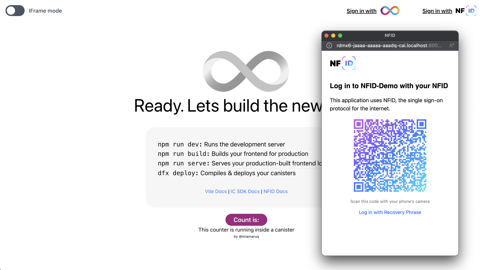
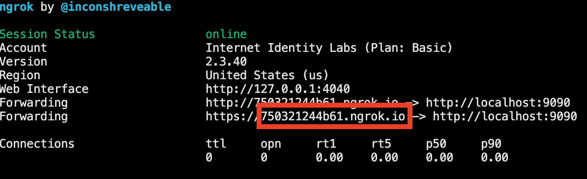

## Create IC App React Demo

<p align="center">
  
</p>

A fully developed application with NFID integrated using React, built on top of an existing application from the community.

## Getting started

#### Dependencies

Open a terminal on the top-level directory of the NFID-SDK, and run the following commands:

```bash
# Step 1: install dependencies (within NFID-SDK root folder)
$ yarn

```

#### Deploying

```bash
# navigate to the right example directory
$ cd examples/create-ic-app-react-demo

# Step 2: run dfx
$ dfx start --clean --background

# Step 3: deploy canisters to local replica
# Hint: if you've restarted dfx, remove .dfx folder or you'll get the error below
# Error: The replica returned an HTTP Error: Http Error: status 404 Not Found, content type "", content: Requested canister does not exist
$ yarn deploy:local
```

```bash
# Step 4: serve nfid_frontend to port 9090 which is used by ngrok tunnel
$ yarn serve:nfid-frontend
```

You can now open `http://localhost:9090` in your browser and preview the nfid-frontend application.

#### Ngrok

In order to scan the QR Code with your mobile phone while your NFID frontend runs on localhost, it's required to setup a reverse proxy. Therefore you need to [download](https://ngrok.com/download) the binary and place the binary `ngrok` within this (`NFID-SDK/examples/create-ic-app-react-demo/scripts`) folder.

```bash
# Step 5: start ngrok tunnel
$ yarn tunnel
```

Copy the assigned domain from `ngrok` output:



and use it to replace `TUNNEL_DOMAIN` in `examples/create-ic-app-react-demo/.env` (copy it first from `.env.template`)

#### Demo Frontend

Once ngrok has been set up, you can run the demo with the following command:

```bash
# Step 6: run the demo front-end and browse localhost:3000
$ yarn dev
```

#### Complete

✨ That is it! The example is now successfully deployed and can be accessed through `localhost:3000`.

#### Integrate NFID into your application

Our react plugin can be found with documentation on [npm](https://www.npmjs.com/package/@internet-identity-labs/react-ic-ii-auth) and you can follow along how it was done in this example [here](src/nfid-integration/Auth.tsx)

---

#### Inspired by

- [@MioQuispe](https://github.com/MioQuispe) - [original example application](https://github.com/MioQuispe/create-ic-app)
