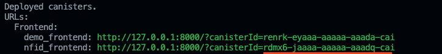

## Create IC App React Demo

<p align="center">
  
</p>

A fully developed example application using the NFID integration with React, built on top of an existing application from the community.

Before getting started, you need to have **DFX** installed on your device. You can find more information and a step-by-step guide on how to set up your DFX [here](https://smartcontracts.org/docs/developers-guide/install-upgrade-remove.html). 

To get the **NFID-SDK** up and running with the [create-ic-app-react-demo](./examples/create-ic-app-react-demo/) example, the following steps are required: 

## Getting started

#### Dependencies
Open a terminal on the root directory of the NFID-SDK, and run the following commands:

```bash
# Step 1: install dependencies
$ yarn

# Step 2: run dfx 
$ dfx start --clean --background
```

#### Deploying nfid-frontend

The next step is to open the `create-ic-app-react-demo` example in the browser. There are two approaches to accomplish this, either with **ngrok** or with your **local canisters**. 

On a new terminal window run:

```bash
# Step 3: run the create-ic-app-react-demo example
$ cd examples/create-ic-app-react-demo
```

#### ngrok
If you want to use ngrok, you can find more details here to set that up for the next step: [setting up with ngrok](../../scripts/README.md).

#### Local canisters

You need to deploy `create-ic-app-react-demo` to your local canister. To do so, you need to run the following commands:

```bash
$ yarn deploy:local
```

If you *don't want to use ngrok* , copy the `.env.template` to `.env` and replace the following variables:



> **Note:** You need to specify an `http` protocol when using local canister. When using ngrok, you can use the default `https` protocol.
> 
```diff
- REACT_APP_NFID_PROVIDER_IFRAME_URL=https://TUNNEL_DOMAIN/iframe-authenticate/?applicationName=NFID-Demo
- REACT_APP_NFID_PROVIDER_URL=https://TUNNEL_DOMAIN/authenticate/?applicationName=NFID-Demo

+ REACT_APP_NFID_PROVIDER_IFRAME_URL=http://rdmx6-jaaaa-aaaaa-aaadq-cai.localhost:8000/iframe-authenticate/?applicationName=NFID-Demo
+ REACT_APP_NFID_PROVIDER_URL=http://rdmx6-jaaaa-aaaaa-aaadq-cai.localhost:8000/authenticate/?applicationName=NFID-Demo
```

Now you can run the example and preview it in the browser!

```bash
# Step 4: run the create-ic-app-react-demo example
$ yarn dev
```

#### Complete

✨ That is it! The example is now successfully deployed and can be accessed through your ngrok tunnel or your local canister (`demo_frontend`).

---

#### Inspired by

- [@MioQuispe](https://github.com/MioQuispe) - [original example application](https://github.com/MioQuispe/create-ic-app)
