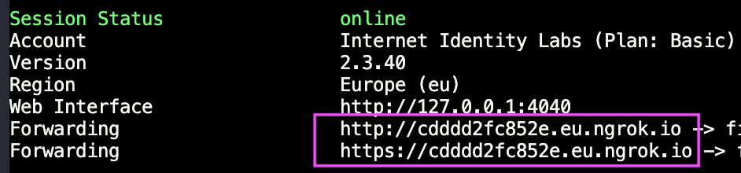

# Scrips

This folder is meant to hold helper scripts to work with NFID SDK packages. Currently there are only two scripts for setting up http proxys with ngrok.

## HTTP Proxy to localhost ([ngrok])

### Setup ngrok

In order to scan the QRCode with your mobile phone while your NFID frontend runs on localhost, it's required to setup a reverse proxy. Therefor you need to [download ngrok]. Place the binary `ngrok` within this (`scripts`) folder.

### Available scripts

#### 1. `tunnel-to-create-ic-app-react-demo-nfid-frontend.sh`

Tunnels to the prebuild nfid frontend for the demo application. To use the tunnel you need to execute the script: `./scripts/tunnel-to-create-ic-app-react-demo-nfid-frontend.sh`

Copy the assigned domain from `ngrok` output:

and use it to replace `TUNNEL_DOMAIN` in `examples/create-ic-app-react-demo/.env` (copy it first from `.env.template`)

#### 2. `tunnel-to-nfid-frontend.sh` (`Internet Identity Labs` Team member only)

Tunnels to the nfid-frontend in development (`nfid-frontend` is currently only available for `Internet Identity Labs` Team member)

**Setup environment**

copy the `.env.local.template` to `.env.local` and replace the following variables:

1. `TUNNEL_PORT` should be `9090` when you're running the default config of `nfid-frontend`
2. `TUNNEL_REGION` depends on your region. Defaults to `eu`.
3. `TUNNEL_DOMAIN` as Internet Identity Labs Team member you'll receive it from your admin. E.g: `john.ngrok.io`

[ngrok]: https://ngrok.com/
[download ngrok]: https://ngrok.com/download
